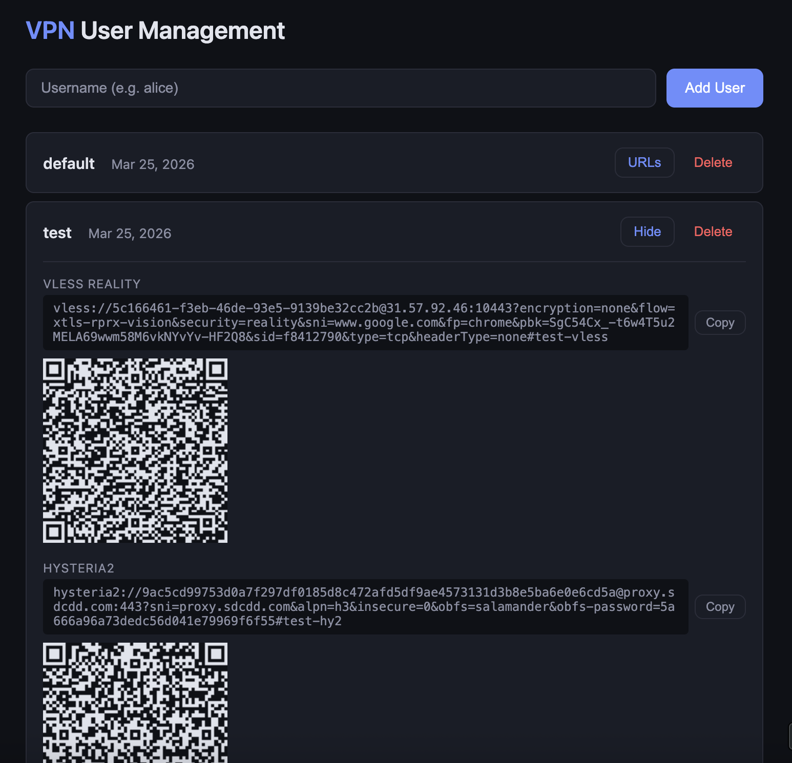

# setup-vpn-server



Automated deployment of a personal proxy server with [sing-box](https://sing-box.sagernet.org/) on Ubuntu.

Protocols configured:

- **VLESS + Reality** — looks like normal TLS traffic, hard to detect
- **Hysteria2** — fast UDP-based transport with Salamander obfuscation
- **SOCKS5** — for Telegram and browsers

Server hardening included:

- SSH key-only auth, root login disabled
- UFW firewall with rate limiting
- fail2ban for SSH, SOCKS, and VLESS
- Local DNS resolver (unbound)
- BBR TCP congestion control

**Web Admin UI** — manage VPN users from the browser (add, remove, view connection URLs with QR codes). No SSH required.

## Quick Start

SSH into your fresh Ubuntu VPS and run:

```bash
curl -sL https://raw.githubusercontent.com/sxwebdev/setup-vpn-server/refs/heads/master/setup.sh -o setup.sh

sudo bash setup.sh \
  --domain vpn.example.com \
  --email you@email.com \
  --username myuser \
  --ssh-key "ssh-ed25519 AAAA..."
```

Or use a key file:

```bash
sudo bash setup.sh \
  --domain vpn.example.com \
  --email you@email.com \
  --username myuser \
  --ssh-key-file /root/.ssh/authorized_keys
```

The script will configure everything and print client connection URLs at the end.

## Parameters

| Parameter          | Required | Default      | Description                                   |
| ------------------ | -------- | ------------ | --------------------------------------------- |
| `--domain`         | yes      | —            | Domain pointing to your server (for TLS cert) |
| `--email`          | yes      | —            | Email for Let's Encrypt                       |
| `--username`       | yes      | —            | Non-root user to create                       |
| `--ssh-key`        | yes\*    | —            | SSH public key string                         |
| `--ssh-key-file`   | yes\*    | —            | Path to SSH public key file                   |
| `--reality-sni`    | no       | `github.com` | Domain to impersonate for Reality             |
| `--socks-port`     | no       | `1081`       | SOCKS5 port                                   |
| `--vless-port`     | no       | `10443`      | VLESS Reality port                            |
| `--hy2-port`       | no       | `443`        | Hysteria2 UDP port                            |
| `--hy2-bandwidth`  | no       | `100`        | Up/down Mbps for Hysteria2                    |
| `--skip-hardening` | no       | —            | Skip server hardening phase                   |
| `--skip-certbot`   | no       | —            | Skip TLS cert (uses self-signed)              |
| `--skip-webui`     | no       | —            | Skip Web Admin UI installation                |
| `--dry-run`        | no       | —            | Show config without executing                 |
| `--show-urls`      | no       | —            | Show current client URLs from saved secrets   |

\* Either `--ssh-key` or `--ssh-key-file` is required.

## Prerequisites

- Fresh Ubuntu 24.04 VPS with root access
- Domain with an A record pointing to your server IP
- SSH public key on your local machine

## What Gets Installed

- **sing-box** — proxy server (from official APT repo)
- **certbot** — TLS certificates from Let's Encrypt
- **ufw** — firewall
- **fail2ban** — brute-force protection
- **unbound** — local DNS resolver
- **acl** — filesystem ACL support
- **jq** — JSON processing (for user management)
- **python3** — Web Admin UI server

## Web Admin UI

The setup script installs a lightweight web panel for managing VPN users remotely — no SSH needed.

**Access:** `https://your-domain:8443`

Admin credentials (username `admin` + generated password) are printed at the end of setup.

Features:

- Add / remove VPN users
- View connection URLs (VLESS, Hysteria2, Telegram SOCKS5)
- QR codes for easy mobile setup
- HTTPS with your Let's Encrypt certificate
- Protected by fail2ban against brute-force

Each user gets independent credentials for all three protocols. Adding or removing a user automatically updates the sing-box config and restarts the service.

To skip Web UI installation, use `--skip-webui`.

View admin password later:

```bash
# The password is shown during setup output.
# The hash is stored in /etc/sing-box/.admin-password
# To reset, re-run setup.sh (it will generate a new password).
```

Check Web UI status:

```bash
sudo systemctl status vpn-admin
sudo journalctl -u vpn-admin -f
```

## Client Apps

Import the generated URLs into:

| Platform    | App                                                            |
| ----------- | -------------------------------------------------------------- |
| Windows     | [v2rayN](https://github.com/2dust/v2rayN)                      |
| Android     | [v2rayNG](https://github.com/2dust/v2rayNG)                    |
| macOS / iOS | [Streisand](https://apps.apple.com/app/streisand/id6450534064) |

## After Setup

View client URLs:

```bash
sudo bash setup.sh --show-urls
```

View raw secrets:

```bash
sudo cat /etc/sing-box/.secrets
```

Check service status:

```bash
sudo systemctl status sing-box
sudo systemctl status vpn-admin
sudo fail2ban-client status
sudo ufw status
```

Watch logs:

```bash
sudo journalctl -u sing-box -f
```

Renew TLS certificate:

```bash
sudo certbot renew
```

## Testing with Docker

Run the test suite locally (no VPS needed):

```bash
./test.sh          # Full integration test
./test.sh syntax   # Syntax check only
./test.sh clean    # Remove test containers
```

## License

MIT
